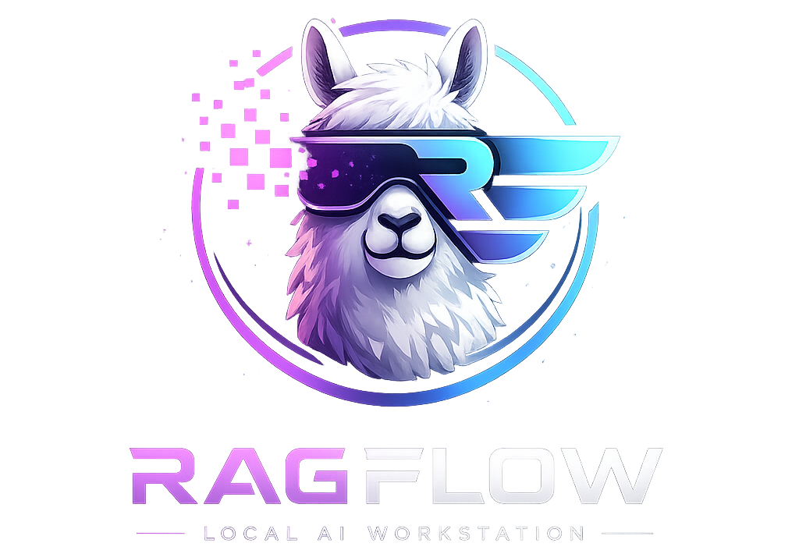
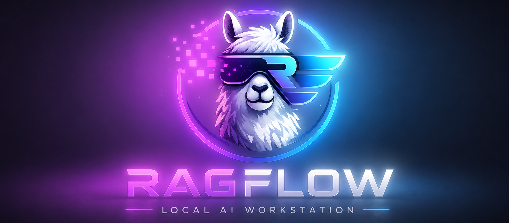
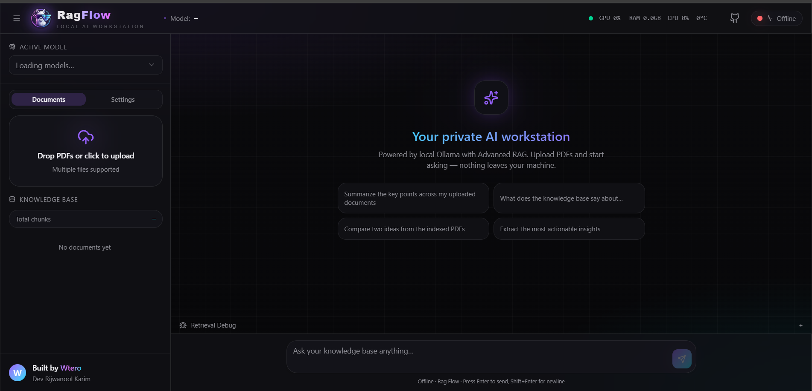

<div align="center">

<p align="center">
	
</p>

# **RagFlow** - Local AI Workstation for Offline RAG & Document Intelligence


### **Private • Offline • Multi-Model • Streaming • Hybrid Retrieval**

</div>

<p align="center">
	
</p>

---

 **RagFlow** is a fully offline Retrieval-Augmented Generation (RAG) platform designed for secure and private document intelligence. The backend, built with FastAPI, provides PDF ingestion, text chunking, semantic embeddings, FAISS vector search, BM25 keyword retrieval, AI-powered reranking, dynamic Ollama model orchestration, configurable LLM settings, streaming responses, and multi-document semantic search.

 The frontend, built with React, TypeScript, and Tailwind CSS, delivers a modern AI workspace with real-time streaming chat, document management, dynamic model selection, live system monitoring, citation-aware responses, and an intuitive interface for interacting with local knowledge bases.


**Why RagFlow?**  
Build privacy-first AI applications using local Ollama models, hybrid retrieval pipelines (FAISS + BM25 + reranking), configurable inference settings, and a polished developer experience—all without relying on external cloud services.

</div>

---

## Screenshots

### Main Chat Interface

Modern streaming AI chat experience with markdown rendering, citations, and dynamic model selection.

<p align="center">
  
</p>

---

## **Architecture Overview**

| Component | Technology | Responsibilities |
|------------|------------|------------------|
| **Frontend (RagFlow UI)** | React, TypeScript, Tailwind CSS, Vite | Provides the user interface for chat, document management, model selection, system monitoring, and settings configuration. |
| **Backend API** | FastAPI | Handles API requests, document processing, retrieval pipelines, model orchestration, and streaming responses. |
| **LLM Layer** | Ollama | Runs local language models for answer generation and multi-model inference. |
| **Retrieval Layer** | FAISS, BM25, Reranker | Performs semantic search, keyword search, result merging, and AI reranking for accurate context retrieval. |
| **Knowledge Base** | PDF Documents + Embeddings | Stores indexed document chunks and embeddings for semantic retrieval. |

---


## Backend Workflow

| Module | Purpose |
|----------|---------|
| Document Upload | Uploads and processes PDFs. |
| Chunking Engine | Splits documents into optimized text chunks. |
| Embedding Generator | Converts chunks into vector embeddings. |
| Vector Store (FAISS) | Stores and retrieves semantic embeddings. |
| BM25 Search | Performs keyword-based retrieval. |
| Hybrid Search | Combines semantic and keyword retrieval. |
| AI Reranker | Improves relevance of retrieved results. |
| Ollama Service | Generates responses using selected local LLM. |
| Streaming API | Streams tokens to the frontend in real time. |
| Runtime Settings | Controls temperature, retrieval limits, and model parameters. |

---

## Frontend Workflow

| Feature | Description |
|----------|------------|
| Chat Interface | Real-time AI conversations with streaming responses. |
| Markdown Rendering | Displays formatted AI responses. |
| Document Manager | Upload, delete, and monitor indexed documents. |
| Model Selector | Switch between installed Ollama models dynamically. |
| Settings Panel | Configure LLM and retrieval parameters. |
| System Monitor | Displays CPU, GPU, RAM, and temperature statistics. |
| Citation Viewer | Shows document sources used for generated answers. |

---

## Documentation

| Component | Description | Documentation |
|------------|------------|------------|
| **Backend API** | FastAPI backend for document ingestion, embeddings, hybrid retrieval, reranking, Ollama orchestration, and streaming responses. | [Backend README](backend/README.md) |
| **Frontend (RagFlow UI)** | React-based AI workspace with streaming chat, document management, model selection, and system monitoring. | [Frontend README](RagFlow_UI/README.md) |

---

## **Features**

- **Offline-First RAG Platform** — Designed for private and secure document intelligence using locally hosted Ollama models.
- **Hybrid Retrieval Pipeline** — Combines FAISS vector search, BM25 keyword retrieval, semantic embeddings, and AI reranking for improved retrieval accuracy.
- **Multi-Model Support** — Dynamically switch between installed Ollama models without restarting the application.
- **Real-Time Streaming Responses** — Supports token-level streaming for a responsive chat experience.
- **Semantic Document Search** — Query and retrieve information across multiple indexed documents.
- **Configurable Inference Settings** — Customize temperature, retrieval depth, reranking limits, and generation parameters.
- **Citation-Aware Answers** — Provides document and page references alongside generated responses.
- **Document Management** — Upload, index, monitor, and remove documents directly from the interface.
- **System Monitoring** — View real-time CPU, GPU, memory utilization, temperature, active model, and indexed chunk statistics.
- **Modern Web Interface** — Built with React, TypeScript, Tailwind CSS, and Vite for a responsive user experience.
- **FastAPI Backend Services** — Modular APIs for document processing, retrieval, model orchestration, and streaming.
- **Extensible Architecture** — Easily integrate additional models, retrievers, rerankers, and vector databases.
- **Fully Local Deployment** — Operates entirely on local hardware without reliance on external cloud services.

---

## **System Requirements**

RagFlow is designed to run entirely on local hardware. The following specifications are recommended for a smooth experience.

| Component | Minimum | Recommended |
|------------|------------|------------|
| Operating System | Windows 10, Ubuntu 22.04+, macOS 13+ | Windows 11, Ubuntu 24.04+ |
| Python | 3.10+ | 3.11+ |
| Node.js | 18+ | 20+ |
| RAM | 8 GB | 16 GB+ |
| CPU | 4 Cores | 8+ Cores |
| GPU | Optional | NVIDIA GPU with 4GB+ VRAM |
| Storage | 5 GB Free Space | 20 GB+ SSD |
| Ollama | Latest Version | Latest Version |

### Tested Configuration

```text
OS          : Windows 11
CPU         : Intel Core i5
RAM         : 16 GB
GPU         : NVIDIA RTX 3050 (4GB)
Python      : 3.12
Node.js     : 22+
Ollama      : Latest
```

### Supported Models

| Category | Example Models |
|------------|------------|
| Chat Models | qwen2.5:3b, llama3.2, mistral, gemma |
| Embedding Models | nomic-embed-text, mxbai-embed-large |

> Larger models may require additional RAM and GPU memory depending on model size and context length.

---

## **Quick Start**

### Prerequisites

Before getting started, install the following:

- Python 3.10+
- Node.js 18+
- Git
- Ollama

### Install Ollama

Download and install Ollama from:

[Download Ollama](https://ollama.com/download)

Pull the required models:

```bash
ollama pull qwen2.5:3b
ollama pull nomic-embed-text
```

Verify installation:

```bash
ollama list
```

---

## Backend Setup

### Option A: Using MeW (Recommended)

[MeW](https://github.com/A3x-parvez/mew) is a lightweight environment management tool that simplifies Python environment creation and activation.

Create and activate an environment:

```bash
mew craft

 > conda / python venv
 > python version
 > environment name [ ragflow ]

mew open

 > ragflow
```

Install dependencies:

```bash
pip install --upgrade pip
pip install -r requirements.txt
```

---

### Option B: Using Standard Python Virtual Environment

```bash
python -m venv .venv

# Linux / macOS
source .venv/bin/activate

# Windows
.venv\Scripts\activate

pip install --upgrade pip
pip install -r requirements.txt
```

---

## Configure Environment Variables

Create a `.env` file in the backend root directory (`backend/.env`) with the following content:

```env
OLLAMA_MODEL=qwen2.5:3b
EMBED_MODEL=nomic-embed-text

VECTOR_PATH=app/storage/vectors/faiss.index
METADATA_PATH=app/storage/vectors/metadata.pkl

UPLOAD_DIR=app/storage/uploads
```
---

### Frontend Setup

```bash
cd RagFlow_UI
npm install
npm run dev (if want to start frontend separately otherwise skip to "Running RagFlow" section)
```

Frontend URL:

```text
http://127.0.0.1:3000
```

> Ensure the RagFlow backend is running before starting the frontend.
---

## **Running RagFlow**

You can run RagFlow in two ways.

### Method 1 — Start Backend and Frontend Separately

#### Start Backend

```bash
cd backend
uvicorn app.main:app --reload --host 0.0.0.0 --port 8000
```

Backend API:

```text
http://127.0.0.1:8000
```

Swagger Documentation:

```text
http://127.0.0.1:8000/docs
```

#### Start Frontend

Open a new terminal:

```bash
cd RagFlow_UI

npm install
npm run dev
```

Frontend:

```text
http://127.0.0.1:3000
```

---

### Method 2 — Launch Everything with One Command (Recommended)

After installing all backend and frontend dependencies and configuring environment variables, you can start both the backend and frontend together using the provided `server.py` script.
make you have setup and activate the Python environment and installed the required dependencies as described in the Backend and frontend Setup section. without the dependency installed in backend and frontend for example if you have not run `pip install -r requirements.txt` in backend and `npm install` in frontend it will throw error when you run the below command.

also make sure yoy run the server.py from the root directory of the project which is `Ollama_Adv_RAG` and not from backend or frontend directory.

```bash
cd Ollama_Adv_RAG
python server.py
```

This automatically starts:

| Service | URL |
|----------|------|
| FastAPI Backend | http://127.0.0.1:8000 |
| Swagger Docs | http://127.0.0.1:8000/docs |
| RagFlow UI | http://127.0.0.1:3000 |

This is the easiest way to run RagFlow during development.

---

## **Use RagFlow UI**

1. Launch RagFlow UI url: http://127.0.0.1:3000
2 .Go to settings and set the backend API URL if you are not running the backend on `http://127.0.0.1:8000` or just hit the connect and check if the connection sucessful.if connection is ok the the ui should show online and all models details in the model selection dropdown.
3. check the system monitor to see the current system stats and active model details.Also if want change the configuration of the model or retrieval you can do that from the settings page.
4. Upload one or more PDF documents.
5. Wait for document indexing to complete.
6. Select an Ollama model.
7. Start chatting with your documents.
8. View citations and sources for generated answers.
9. After chatting you can simply delete any specific uploaded document or you can also clear the entire indexed document and start fresh from the document management page.

RagFlow automatically performs:

- PDF extraction
- Intelligent chunking
- Embedding generation
- FAISS vector indexing
- BM25 keyword indexing
- Hybrid retrieval
- AI reranking
- Context generation
- Streaming response generation

All processing runs locally, ensuring complete privacy and offline operation.

## **Project Layout**
- **backend/** — FastAPI app, services, RAG pipeline components and storage.
	- Core entry: [backend/app/main.py](backend/app/main.py#L1)
	- RAG code: [backend/app/rag/](backend/app/rag/)
- **RagFlow_UI/** — Vite + React frontend. See [RagFlow_UI/src/start.ts](RagFlow_UI/src/start.ts#L1)

---

## **Configuration & Environment**

RagFlow uses environment variables for model configuration, storage locations, and runtime settings.

Create a `.env` file in the backend root directory:

```env
OLLAMA_MODEL=qwen2.5:3b
EMBED_MODEL=nomic-embed-text

VECTOR_PATH=app/storage/vectors/faiss.index
METADATA_PATH=app/storage/vectors/metadata.pkl

UPLOAD_DIR=app/storage/uploads
```

### Runtime Configuration

The following settings can be adjusted directly from the UI or via the Settings API:

| Setting | Description |
|----------|------------|
| `temperature` | Controls response creativity and randomness |
| `top_k` | Number of retrieved chunks before reranking |
| `rerank_top_k` | Number of chunks retained after reranking |
| `max_tokens` | Maximum response length |

> Model selection is handled dynamically through Ollama, allowing seamless switching between installed local models without restarting the application.

## Development Tips

- Ensure Ollama is running before starting the backend.
- Re-index documents after changing the embedding model or chunking strategy.
- Use the FastAPI Swagger UI (`/docs`) to explore and test API endpoints.
- Monitor retrieval quality by adjusting `top_k`, `rerank_top_k`, and `temperature` settings.
- Frontend and backend can be developed and run independently during development.
- Use the document management panel to upload, delete, and re-index knowledge base documents.
- Check the system monitoring dashboard to track CPU, GPU, RAM, and model utilization.
- Use streaming chat endpoints for a more responsive user experience.

--- 

## **Contributing**
- Fork, make changes on a feature branch and open a PR. Keep changes focused and testable.
- Add docs to `backend/README.md` or `RagFlow_UI/README.md` for large features.

---

## **Troubleshooting**

| Issue | Solution |
|---------|----------|
| Ollama model not found | Ensure Ollama is installed and the required models have been pulled using `ollama pull <model-name>`. |
| Backend fails to start | Verify the virtual environment is activated and dependencies are installed with `pip install -r requirements.txt`. |
| Frontend cannot connect to backend | Confirm the FastAPI server is running and the API URL is correctly configured. |
| No results returned from documents | Ensure documents have been uploaded and indexed successfully. |
| Changes to embedding model not reflected | Clear existing documents and re-index the knowledge base after changing embedding models. |
| PDF deletion or indexing issues | Restart the backend and verify the storage directories have proper read/write permissions. |
| Slow response times | Reduce `top_k`, `rerank_top_k`, or use a smaller Ollama model. |
| High memory usage | Large documents and models may require additional RAM and storage resources. |
| GPU not detected | Verify GPU drivers are installed and supported by your Ollama/PyTorch setup. |
| API testing | Use the FastAPI Swagger UI available at `/docs` to inspect and test endpoints. |

---

## **Author**

<div align="center">

### Built with ❤️ by Rijwanool Karim

Founder of **Wtero** • AI Engineer • Full-Stack Developer • Open Source Enthusiast

<p>
  <a href="https://github.com/A3x-parvez">
    
  </a>
  
  <a href="https://www.linkedin.com/in/rijwanool-karim">
    
  </a>

  <a href="https://rijwanool-karim.vercel.app/" target="_blank">
	
	</a>
  
  <a href="https://wtero.com">
    
  </a>
</p>

Building privacy-first AI products, local LLM solutions, intelligent automation systems, and modern developer tools.

**RagFlow** is part of the Wtero ecosystem focused on accessible, offline, and secure AI experiences.

</div>

---

### Support the Project

If you find RagFlow useful:

- ⭐ Star the repository
- 🐛 Report bugs and suggest features
- 🔀 Submit pull requests
- 📢 Share the project with others

Your support helps improve the project and future open-source AI tools.


## **License**

Distributed under the MIT License. See the [LICENSE](LICENSE) file for more information.

---